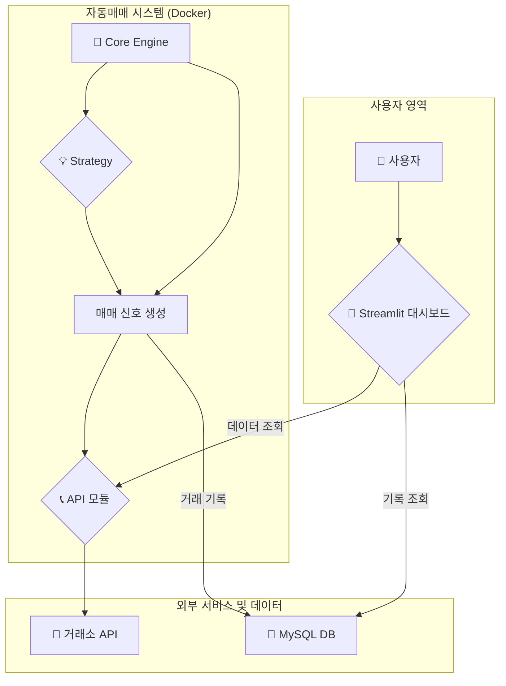

---

🌳 **모아봐요 코인의 숲**

> 24시간 잠들지 않는 AI 주민 '너굴'과 함께, 스트레스 없는 코인 투자를 시작해보세요!

---

### 🏝️ 어떤 프로젝트인가요?

혹시 주식이나 코인 가격을 보며 하루에도 몇 번씩 기분이 오락가락한 경험, 없으신가요?

  '모아봐요 코인의 숲'은 이 모든 감정적인 요소를 배제하고, 사전에 설정된 명확한 원칙에 따라서만 거래하는 100% 자동매매 시스템입니다. 당신이 잠든
  사이에도, AI 주민 '너굴'이 24시간 쉬지 않고 당신의 자산을 안전하게 관리하고 불려줍니다.

  🧑‍🌾 너굴의 '씨앗 농법' (핵심 매매 전략)

  AI 주민 '너굴'은 절대 '대박'을 노리지 않습니다. 대신, 아주 단순하고 안정적인 '씨앗 농법'을 24시간 반복하여 꾸준히 자산을 늘려나갑니다.

  1. 🌱 씨앗은 조금만, 그리고 나눠서 심기 (소액 분할 매수)
  너굴은 절대 '몰빵'하지 않아요! 처음에는 아주 적은 금액으로 첫 씨앗을 심어 리스크를 최소화합니다.

  2. 💧 비가 오면 신나서 물 주기 (하락 시 추가 매수)
  너굴에게 가격 하락은 위기가 아닌 기회입니다. 비가 와서 땅값이 싸지면, 계획적으로 씨앗을 더 심어서(추가 매수) 전체 자산의 평균 매입 단가를
  낮춥니다.

  3. 🍅 작은 열매만 꾸준히 수확하기 (고빈도 저수익 실현)
  너굴은 욕심이 없어요. 수박만 한 호박을 기다리지 않습니다. 방울토마토 같은 아주 작은 수익(예: 0.5%~1%)이 발생하면 즉시 수확(매도)하여 수익을
  확정합니다. 그리고 이 '작은 수확'을 24시간 동안 수천 번 반복하여, 티끌 모아 태산을 만듭니다.

  ✨ 주요 특징

   * 🤖 100% 감정 배제: 탐욕과 공포 없이, 오직 정해진 규칙으로만 거래합니다.
   * 📝 쉬운 설정: 코딩 지식이 없어도 setting.csv 파일 하나로 매매 전략을 쉽게 설정하고 변경할 수 있습니다.
   * 🐳 Docker 기반의 24/7 운영: 제 컴퓨터를 꺼놔도, Docker 컨테이너 기술을 통해 서버에서 24시간, 365일 안정적으로 작동합니다.
   * 🧾 투명한 기록: 모든 거래 내역은 데이터베이스(MariaDB)에 차곡차곡 기록되어 언제든 확인할 수 있습니다.

  🚀 시작하기

   1. 이 프로젝트를 당신의 컴퓨터로 복제(Clone)합니다.
   2. .env.example 파일을 .env로 복사하고, 당신의 API 키 정보를 입력합니다.
   3. setting.csv 파일에 당신이 원하는 거래 전략(코인, 금액 등)을 작성합니다.
   4. 터미널에서 아래의 명령어를 실행하면, 당신의 섬이 활동을 시작합니다!
   1     docker-compose up -d

  ⚙️ 섬 관리하기 (프로그램 제어)

  언제든지 당신의 섬을 관리하고 싶을 때, 아래의 명령어들을 사용하세요.

  ▶️ 섬 활동 시작하기

  AI 주민들을 깨워 섬의 활동을 시작합니다.

   1 docker-compose up -d

  ⏹️ 섬 활동 중지하기

  모든 활동을 안전하게 멈추고 AI 주민들을 잠에 들게 합니다. (데이터는 안전하게 보관됩니다.)

   1 docker-compose down

  📋 활동 로그 확인하기

  AI 주민 '너굴'이 지금 무슨 일을 하고 있는지 실시간으로 확인하고 싶을 때 사용하세요.

   1 docker logs cointradesystem

### 🏛️ 시스템 아키텍처

  ⚠️ 중요 안내

   * 이 프로젝트는 자동매매 시스템의 원리를 학습하고, 기술을 구현해보기 위한 교육 및 학습 목적으로 제작되었습니다.
   * 모든 투자의 책임은 투자자 본인에게 있습니다.
   * 절대 실제 돈을 사용하여 테스트하지 마시고, 반드시 모의 투자 기능을 이용해주세요.